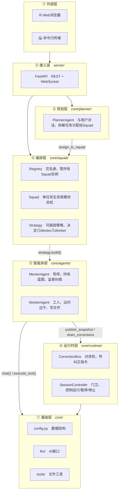

# Echelon AI 开发文档

## 目录

1. [项目概述](#项目概述)
2. [技术栈](#技术栈)
3. [项目结构](#项目结构)
4. [架构设计](#架构设计)
5. [核心模块详解](#核心模块详解)
6. [API 接口文档](#api-接口文档)
7. [前端开发指南](#前端开发指南)
8. [数据存储](#数据存储)
9. [开发环境搭建](#开发环境搭建)
10. [调试技巧](#调试技巧)
11. [扩展指南](#扩展指南)
12. [常见问题](#常见问题)

---

## 项目概述

Echelon AI 是一个多智能体协作框架，采用 **Planner → Squad（Mentor × Worker）** 分层架构：

- **Planner（规划者）**：与用户对话，理解需求，将任务拆解并分配给 Squad
- **Mentor（导师）**：持有设计蓝图（blueprint），是知识的唯一来源；监督 Worker 的工作，必要时纠正或回滚
- **Worker（工人）**：从零开始执行任务，通过 `ask_mentor` 向 Mentor 获取信息，使用文件工具编写代码

一个 Squad = 至少一个 Mentor + 至少一个 Worker（由 SquadStrategy 决定组合方式）。Planner 可以同时创建多个 Squad 并行执行不同子任务。

---

## 技术栈

| 层级 | 技术 | 说明 |
|------|------|------|
| 后端 | Python 3.12+ / FastAPI | 异步 Web 框架，提供 REST + SSE + WebSocket |
| LLM | OpenAI 兼容 API（DeepSeek） | 通过 `core/llm/` 抽象，支持 OpenAI / Anthropic |
| 前端 | React 19 + Vite 8 | SPA，内联样式，无 CSS 框架依赖 |
| 实时通信 | SSE（流式对话）+ WebSocket（Squad 进度） | |
| 代码质量 | oxlint（前端） | |

---

## 项目结构

```
MUTI_AI-main/
├── .data/                        # 用户数据（已 gitignore）
│   ├── planners/                 # 每个 Planner 一个目录
│   │   └── {name}/
│   │       ├── meta.json         # Planner 元信息（名称、描述、图标）
│   │       ├── history.json      # Planner 对话历史
│   │       └── logs/             # Squad 运行日志
│   └── squads/                   # 每个 Squad 一个目录
│       └── {name}/
│           ├── config.json       # Squad 配置
│           ├── mentor/
│           │   ├── blueprint.md  # Mentor 私有蓝图
│           │   └── history.json  # Mentor 对话历史
│           └── worker/
│               ├── history.json  # Worker 对话历史
│               └── *             # Worker 生成的文件
├── core/                         # 核心逻辑
│   ├── config.py                 # 数据模型：ModelConfig, SessionConfig
│   ├── runtime/
│   │   ├── bus.py                # CorrectionBus + WorkerSnapshot + ProgressState
│   │   └── session.py            # SessionController（暂停/恢复/停止）
│   ├── agents/
│   │   ├── base.py               # BaseAgent 抽象基类
│   │   ├── mentor.py             # MentorAgent
│   │   └── worker.py             # WorkerAgent
│   ├── squad/
│   │   ├── squad.py              # Squad 生命周期编排
│   │   ├── registry.py           # SquadRegistry 全局注册表
│   │   ├── session.py            # TUI 终端交互层
│   │   └── strategy.py           # SquadStrategy 可插拔策略
│   ├── planner/
│   │   └── planner.py            # PlannerAgent
│   ├── llm/
│   │   ├── __init__.py           # chat() 统一入口
│   │   ├── base.py               # 路由到 provider
│   │   ├── openai_provider.py    # OpenAI 兼容实现（含流式）
│   │   └── anthropic_provider.py # Anthropic 实现
│   └── tools/
│       ├── registry.py           # 工具 schema 定义 + execute_tool
│       └── filesystem.py         # 文件系统工具（read/write/append/list）
├── display/                      # 输出/日志系统
│   ├── __init__.py               # 所有 display 函数的统一导出（Web 模式）
│   ├── terminal.py               # 终端模式富文本输出
│   ├── app.py                    # Textual TUI 应用入口
│   ├── planner_ui.py             # Planner 终端交互界面
│   ├── squad_ui.py               # Squad 管理终端界面
│   └── welcome.py                # 欢迎界面
├── server/
│   └── main.py                   # FastAPI 后端（REST + SSE + WebSocket）
├── web/                          # React 前端
│   ├── src/
│   │   ├── main.jsx              # 入口
│   │   ├── App.jsx               # 主应用（布局、状态管理、主题切换）
│   │   ├── api.js                # API 客户端 + SSE 流 + WebSocket
│   │   ├── themes.js             # 三套主题配置（dark/light/midnight）
│   │   ├── components.jsx        # 通用组件
│   │   └── index.css             # 全局样式 + 动画关键帧
│   ├── dist/                     # 构建产物（由 Vite 生成）
│   ├── index.html
│   ├── vite.config.js
│   └── package.json
├── devtools/                     # 开发工具
│   ├── workspace/                # 临时文件目录
│   ├── check_env.py              # 环境检测脚本
│   ├── install_deps.py           # 一键安装依赖
│   └── DEVELOPMENT.md            # 本文档
├── .env                          # API 密钥（已 gitignore）
├── .env.example                  # 环境变量模板
├── launch.py                     # 启动脚本
└── run.bat                       # Windows 一键启动
```

---

## 架构设计

### 层级关系图



**读图规则：箭头方向 = 依赖方向。上层依赖下层，下层完全不知道上层的存在。**

### Agent 职责对比

| Agent | 知道什么 | 做什么 | 工具 |
|-------|---------|--------|------|
| Planner | 用户需求 | 对话、拆解、assign_to_squad | assign_to_squad |
| Mentor | 完整蓝图 | 监督评估、纠正/回滚、回答提问 | read/write/list |
| Worker | 什么都不知道 | 执行任务、写文件、ask_mentor | read/write/append/list + ask_mentor + finish_task |

### CorrectionBus 机制

`CorrectionBus` 是 Mentor 和 Worker 之间的异步通信管道：

- **Mentor → Worker**：
  - `inject_correction()`：轻微纠正，下一轮开头以 `[MENTOR CORRECTION]` 注入
  - `inject_rollback()`：严重错误，回滚文件到快照状态，恢复消息上下文
- **Worker → Mentor**：
  - `publish_snapshot()`：每轮结束后发布 WorkerSnapshot，触发 Mentor 评估
- **进度**：
  - `update_progress()`：Mentor 评估进度后更新 ProgressState，推送到前端

### Squad 策略机制

Squad 通过 `SquadStrategy` 决定内部 Agent 的组合方式，默认为 `SinglePairStrategy`（1 Mentor + 1 Worker）：

```python
# 使用默认策略
squad = Squad.create(name, task, blueprint, squads_dir)

# 注入自定义策略
squad = Squad.create(..., strategy=MyStrategy())
```

---

## 核心模块详解

### core/config.py

```python
@dataclass
class ModelConfig:
    provider: Literal["openai", "anthropic"]
    model: str                     # 如 "deepseek-chat"
    api_key: str
    base_url: str | None = None    # 如 "https://api.deepseek.com"
    temperature: float = 0.7
    max_tokens: int = 8192

@dataclass
class SessionConfig:
    task: str
    project_root: str
    worker_subdirs: list[str]      # Worker 可写的子目录
    mentor_model: ModelConfig
    worker_model: ModelConfig
    max_rounds: int = 20
    mentor_system: str             # Mentor 系统提示词
    worker_system: str             # Worker 系统提示词
    tool_schemas: list[dict]       # 可用工具的 JSON Schema
```

### core/agents/ — 智能体层

**base.py** — 所有 Agent 的抽象契约：
```python
class BaseAgent(ABC):
    @abstractmethod
    async def run(self, task: str) -> None: ...
    @abstractmethod
    async def chat_direct(self, user_input: str) -> str: ...
```

**worker.py — WorkerAgent** 核心执行循环：
```
for each round:
  1. wait_resume()           # 支持暂停/恢复
  2. _maybe_compress()       # 历史超过 30 条时压缩为摘要
  3. _repair_messages()      # 修复孤立 tool_calls，防止 API 400
  4. chat() → response       # 调用 LLM
  5. 处理 tool_calls:
     - finish_task  → 标记完成
     - ask_mentor   → 调用 mentor.answer_question()
     - 其他工具    → execute_tool()
  6. publish_snapshot()      # 发布给 Mentor 审查
  7. _save()                 # 持久化历史
```

**mentor.py — MentorAgent**：
- 注册 `bus.on_snapshot()` 回调，每轮自动评估 Worker
- 评估返回 `OK` / `CORRECT: <fix>` / `ROLLBACK: <reason>`
- 独立的 `_update_progress()` 调用，失败不影响主评估
- `answer_question()`：响应 Worker 的 ask_mentor 提问
- `run()` 是空实现——Mentor 是被动驱动的，不需要主循环，由 `bus.on_snapshot` 触发

### core/squad/ — 编排层

**squad.py — Squad 生命周期状态机**：
- `Squad.create()` — 初始化目录、写蓝图、清除旧历史
- `Squad.load()` — 从磁盘恢复已有 Squad（刷新页面后复原）
- `squad.start(model, push_event)` — 异步后台启动，立即返回
- `squad.stop()` — 发信号给 SessionController
- `squad.mentors` / `squad.workers` — 公开属性，TUI 可直接访问
- `_run()` 启动时调用 `display.set_squad_name(name)` 设置 Squad 上下文，并立即推送两条确认消息，用户可实时看到 Squad 已开始工作

**registry.py — SquadRegistry**：
- `scan()` — 进程启动时扫描磁盘，恢复遗留 Squad 列表
- `create()` — 创建并注册新 Squad（清除同名旧历史）
- `delete()` — 先 `stop()` 再删磁盘，防止写入竞态

**strategy.py — SquadStrategy**（可插拔扩展点）：
```python
class SquadStrategy(ABC):
    @abstractmethod
    async def build(cfg, bus, ctrl, mentor_dir, worker_dir) -> (mentors, workers): ...

class SinglePairStrategy(SquadStrategy):
    """默认：1 Mentor + 1 Worker"""
```

### core/runtime/ — 运行时基础设施

**bus.py — CorrectionBus**：
- correction 队列和 rollback 队列解耦
- rollback 含文件快照，可精确还原到指定轮次
- `on_progress()` 回调列表，支持多订阅者

**session.py — SessionController**：
- 状态：`RUNNING` / `PAUSED` / `STOPPED` / `ERROR`
- `pause(target)` — 可精确暂停 "worker" 或 "mentor"

### core/llm/ — LLM 抽象层

```
chat(cfg, messages, tools?, on_token?) → dict
  ├── provider="openai"    → _openai_chat()    # 含流式累积
  └── provider="anthropic" → _anthropic_chat()
```

切换模型只需修改 `server/main.py` 的 `_make_model()`。

### core/tools/ — 工具系统

四个基础工具（Worker 可用）：

| 工具 | 说明 |
|------|------|
| `read_file(path)` | 读取文件内容 |
| `write_file(path, content)` | 写入文件（覆盖） |
| `append_file(path, content)` | 追加内容（大文件分块写入） |
| `list_dir(path)` | 列出目录 |

所有路径经 `_resolve_safe()` 校验，不能访问 allowed_roots 以外的目录。

### display/ — 输出系统

`display/__init__.py` 是 Web 模式下的适配器，所有函数通过 `_push()` 发送 WebSocket 事件并写日志。`display/terminal.py` 是终端模式下的富文本输出实现，两者函数签名相同。

**Squad 上下文机制**：`_push()` 会自动在事件中附加当前 Squad 名（通过 `contextvars` 上下文变量），前端可按 `squad` 字段过滤不同 Squad 的日志，多 Squad 并行时不会串台。

```python
# squad._run() 开始时设置上下文
display.set_squad_name("my_squad")

# 之后所有 _push() 自动附加 squad 字段
# {"type": "session_line", "line": "...", "squad": "my_squad"}
```

关键函数：

| 函数 | 事件类型 | 用途 |
|------|----------|------|
| `set_squad_name(name)` | — | 设置当前 Squad 上下文 |
| `worker_header(round)` | session_line | 轮次标题 |
| `worker_tool_call(name, args)` | session_line | 工具调用 |
| `worker_tool_result(name, result)` | session_line | 工具结果 |
| `mentor_ok(round)` | session_line | Mentor 审查通过 |
| `mentor_interrupt(round, correction)` | session_line | Mentor 纠正 |
| `error_msg(who, err)` | session_line | 错误信息 |
| `update_progress_bar(percent, status)` | session_progress | 进度更新（含阶段名） |

---

## API 接口文档

### Planner

| 方法 | 路径 | 说明 |
|------|------|------|
| GET | `/api/planners` | 列出所有 Planner |
| POST | `/api/planners` | 创建 Planner `{name, description, icon}` |
| DELETE | `/api/planners/{name}` | 删除 Planner |
| GET | `/api/planners/{name}/history` | 获取对话历史 |
| POST | `/api/planners/{name}/chat/stream` | 发送消息（SSE 流式） |
| GET | `/api/planners/{name}/open` | 打开 Planner 文件夹 |

### Squad

| 方法 | 路径 | 说明 |
|------|------|------|
| GET | `/api/squads` | 列出所有 Squad（含状态） |
| GET | `/api/squads/{name}` | 查询单个 Squad |
| DELETE | `/api/squads/{name}` | 删除 Squad |
| POST | `/api/squads/{name}/stop` | 停止正在运行的 Squad |
| GET | `/api/squads/{name}/open` | 打开 Squad 文件夹 |

### 其他

| 方法 | 路径 | 说明 |
|------|------|------|
| GET | `/api/settings` | 获取设置（API Key 状态） |
| POST | `/api/settings/apikey` | 设置 API Key `{api_key}` |
| POST | `/api/open-folder` | 打开任意文件夹 `{path}` |
| WebSocket | `/ws` | 实时事件推送 |

### SSE 流式格式

```
data: {"token": "Hello"}
data: {"token": " world"}
data: {"done": true, "squads": [{"squad": "snake_game", "task": "..."}]}
data: {"error": "API Key 无效，请在设置中更新 DEEPSEEK_API_KEY"}
```

SSE 流中的 `error` 字段表示 LLM 调用失败，前端会将其显示为红色错误块，并终止流。

### WebSocket 事件格式

```json
{"type": "session_line",     "line": "⚙ 写入文件  index.html",  "squad": "snake_game"}
{"type": "session_progress", "percent": 45.0, "status": "第2/5步: 编写核心逻辑", "squad": "snake_game"}
{"type": "session_done",     "squad": "snake_game", "status": "ok",    "report": "..."}
{"type": "session_done",     "squad": "snake_game", "status": "error", "report": "错误详情..."}
```

`session_line` 和 `session_progress` 都携带 `squad` 字段，前端按此字段过滤，多 Squad 并行时日志不会串台。`session_progress` 新增 `status` 字段显示当前阶段名。`session_done` 的 `status` 区分 `"ok"` 和 `"error"` 两种终态。

---

## 前端开发指南

### 主题系统

`themes.js` 导出 `THEMES` 对象，包含三套主题：

```javascript
const THEMES = {
  dark:     { accent: "#a1a1aa", ... },
  light:    { accent: "#71717a", ... },
  midnight: { accent: "#94a3b8", ... },
};
```

通过 `ThemeCtx` Context 在组件树中传递，`useC()` 获取当前主题。

**添加新主题**：在 `themes.js` 中添加新 key，在 `App.jsx` 的 `cycleTheme` 中加入轮换列表。

### 样式约定

- 全部使用内联样式（`style={{...}}`），无 CSS 框架
- 颜色统一引用 `C.xxx`，不硬编码色值
- 特殊语义色（错误红 `#ef4444`、警告黄 `#f59e0b`）允许硬编码
- 动画定义在 `index.css` 的 `@keyframes` 中

### 前端构建

```bash
cd web
npm install
npm run dev      # 开发服务器 (port 5173)
npm run build    # 构建到 web/dist/
npm run lint     # oxlint 检查
```

---

## 数据存储

```
.data/
├── planners/
│   └── {name}/
│       ├── meta.json         # {"name":"...", "description":"...", "icon":"🤖"}
│       ├── history.json      # Planner 完整对话历史
│       └── logs/
│           └── {squad}.log   # Squad 运行日志
└── squads/
    └── {name}/
        ├── config.json       # {"name":"...", "description":"..."}
        ├── mentor/
        │   ├── blueprint.md  # Mentor 私有蓝图（Planner 写入）
        │   └── history.json  # Mentor 对话历史
        └── worker/
            ├── history.json  # Worker 对话历史
            └── *             # Worker 生成的文件
```

---

## 开发环境搭建

### 前置要求

- Python 3.12+
- Node.js 18+
- npm

### 一键安装

```bash
# 检测环境
python devtools/check_env.py

# 安装所有依赖（Python + 前端）
python devtools/install_deps.py
```

### 手动安装

```bash
# Python 依赖
pip install fastapi "uvicorn[standard]" openai anthropic rich

# 前端依赖
cd web && npm install && cd ..

# 配置 API Key
cp .env.example .env
# 编辑 .env，填入 DEEPSEEK_API_KEY
```

### 启动

```bash
# Windows 一键启动
run.bat

# 手动启动（开发模式，前后端分离，前端热更新）
python launch.py

# 访问
# 前端: http://localhost:5173
# 后端: http://localhost:8765
```

### 切换 LLM Provider

编辑 `.env`：

```env
# DeepSeek（默认）
DEEPSEEK_API_KEY=sk-xxx
DEEPSEEK_BASE_URL=https://api.deepseek.com
```

修改 `server/main.py` 中的 `_make_model()` 函数指向目标 provider。

---

## 调试技巧

### 查看 Squad 运行日志

日志存储在 `.data/planners/{name}/logs/{squad}.log`：

```
[14:30:01] ━━━  Worker 工作中  ·  第 1 轮  ━━━
[14:30:05]   ⚙ 写入文件  index.html
[14:30:05]   └ Written 1234 chars to ...
[14:30:08]   ✓ Mentor 审查第 1 轮：通过
```

### 查看 Agent 对话历史

- Planner: `.data/planners/{name}/history.json`
- Mentor:  `.data/squads/{name}/mentor/history.json`
- Worker:  `.data/squads/{name}/worker/history.json`

历史格式为 OpenAI Messages 格式：`[{"role": "system/user/assistant/tool", "content": "..."}]`

### 终端模式调试

```bash
python -m core.squad.session
```

可用命令：`stop` / `pause worker` / `pause mentor` / `resume` / `status` / `help`

### 常见错误排查

| 错误 | 原因 | 解决 |
|------|------|------|
| `insufficient tool messages following tool_calls` | 历史中有孤立 tool_calls | Worker 内置 `_repair_messages()` 自动修复；仍有问题则删除对应 `history.json` |
| `Worker LLM error: 401` / 前端显示"API Key 无效" | API Key 未配置或已失效 | 在前端设置面板填入有效 Key，或直接编辑 `.env` 中的 `DEEPSEEK_API_KEY` |
| 前端显示"请求频率超限" | DeepSeek 限流（429） | 稍等片刻后重试 |
| 前端显示"请求超时" | 网络问题或服务端响应慢 | 检查网络连接，确认 `DEEPSEEK_BASE_URL` 正确 |
| Squad 日志面板一直显示"等待 Squad 启动…" | Squad 启动异常或 WebSocket 未连接 | 刷新页面重新连接 WebSocket；查看后端控制台是否有 `TypeError` |
| `Can't instantiate abstract class MentorAgent` | MentorAgent 缺少 `run()` 实现 | 已修复，`run()` 为空实现满足 BaseAgent 契约 |
| `Squad 进度一直是 0%` | Mentor 进度评估失败 | 查看 Squad 日志，确认 Mentor 是否正常运行 |
| `Unknown tool: append_file` | 旧版本工具未注册 | 已修复，`make_file_handlers()` 包含四个工具 |

---

## 扩展指南

### 添加新工具

1. 在 `core/tools/registry.py` 的 `_TOOL_SCHEMAS` 中添加 JSON Schema
2. 在 `core/tools/filesystem.py` 的 `make_file_handlers()` 中添加实现并注册

### 添加新 Agent 类型

1. 在 `core/agents/` 下创建新文件，继承 `BaseAgent`
2. 实现 `run()` 和 `chat_direct()` 方法
3. 在自定义 `SquadStrategy.build()` 中使用

### 添加新 Squad 策略

```python
# core/squad/strategy.py
class MultiPairStrategy(SquadStrategy):
    @property
    def name(self): return "multi_pair"

    async def build(self, cfg, bus, ctrl, mentor_dir, worker_dir):
        # 实例化 N 个 Mentor 和 N 个 Worker
        return [mentor1, mentor2], [worker1, worker2]
```

### 切换 LLM 模型

修改 `server/main.py` 中的 `_make_model()` 函数。支持任何 OpenAI 兼容 API。

### 修改主题配色

编辑 `web/src/themes.js`，修改对应主题的 `accent`、`accentEnd`、`accentGrad` 等字段。

---

## 常见问题

**Q: 如何给不同 Agent 使用不同模型？**

修改 `server/main.py` 的 `_make_model()` 或在 `SessionConfig` 中分别设置 `mentor_model` 和 `worker_model`。

**Q: 如何自定义 Mentor/Worker 的系统提示词？**

修改 `core/squad/squad.py` 中的 `_MENTOR_SYSTEM_WITH_BLUEPRINT` 和 `_WORKER_SYSTEM` 常量。

**Q: 数据目录在哪？**

所有用户数据在项目根目录的 `.data/` 下：
- `.data/planners/` — Planner 数据
- `.data/squads/` — Squad 数据（Mentor + Worker + 生成文件）

**Q: 前端如何添加新页面/组件？**

1. 在 `web/src/components.jsx` 中创建组件
2. 在 `web/src/App.jsx` 中引入和使用
3. 所有样式使用内联 + `C` 主题对象
